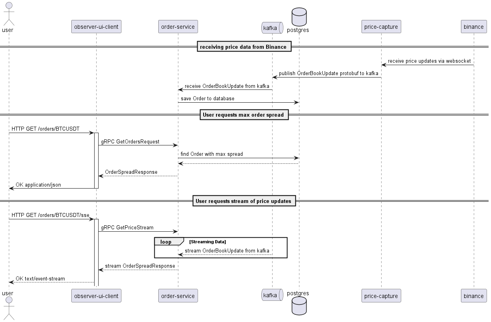

# Reactive Quarkus Crypto Capture Demo

This project explores the Quarkus ecosystem by utilizing reactive programming, reactive Panache, gRPC, Kafka and Quarkus.

It consists of several modules including:
- `grpc-tools` : shared dependency for gRPC protos and converters
- `price-capture` : captures price data from cryptocurrency exchange and publishes it to Kafka
- `order-service` : gRPC server, consumes price data from Kafka and persists Orders to a postgres database
- `observer-ui-client` : web UI, exposes a REST API to query Orders and streams real-time updates via Server-Sent Events (SSE), gRPC client

## Prerequisites
- Java 21
- Maven
- Docker

## Build and Run
To compile the project, run the following command:
```sh
mvn clean install
```

### Running the applications locally
1. Launch a Redpanda Kafka cluster with Console UI:
```sh
docker compose -f 'docker-compose.dev.yaml' up
```
2. Launch Quarkus instances in development mode on your local machine:
```sh
mvn quarkus:dev -pl price-capture
mvn quarkus:dev -pl order-service
mvn quarkus:dev -pl observer-ui-client
```
2.(alt) Alternatively, you can launch all three applications at once using an experimental Maven feature:
```sh
mvn -T 3 quarkus:dev -pl price-capture,order-service,observer-ui-client
```
The observer-ui-client will be available at http://localhost:8080.

### Running all applications inside Docker
1. Build project and create Docker image:
```sh
mvn install -Dquarkus.container-image.build=true -DskipTests
```
2. Launch all services inside Docker:
```sh
docker compose up
``` 

The observer-ui-client will be available at http://localhost:8080.

## Service interaction sequence diagram


